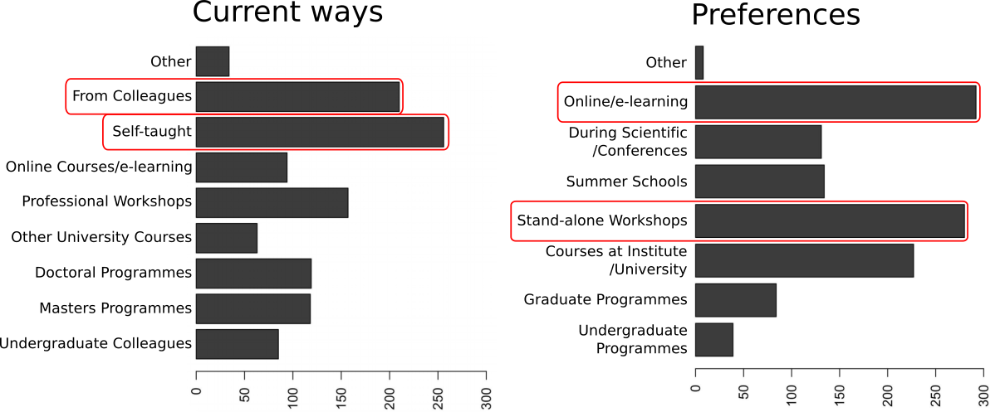
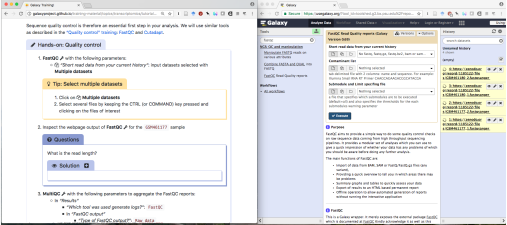

### The training effort of the Galaxy community

 <!-- .element width="60%" -->

Bérénice Batut - University of Freiburg, de.NBI (ELIXIR-DE)

<small>
ELIXIR Bioinformatics Training Tools Workshop - February 2019
</small>

---
### Need and demand for bioinformatic training

> Bioinformatics has become too central to biology to be left to specialist bioinformaticians 

 <!-- .element width="80%" -->

<small>Graphs of [Brazas et al, 2017](http://biorxiv.org/content/early/2017/02/27/098996)</small>

----
### Galaxy: a great solution !

 <!-- .element width="60%" -->

- Web interface for numerous bioinformatics tools
- No issue with computer configuration during training

----

 <!-- .element width="100%" -->

---
### Galaxy Training materials

 <!-- .element width="70%" -->

https://training.galaxyproject.org

<small>
Online training material covering many current research topics
</small>

Note:

17 topics

----
### Interactive learning via hands-on tutorials  built around a "research story"

 <!-- .element width="100%" -->

Usable for effective training for individual users & instructors

Note:

Designed to be interactive and built around Galaxy

Built around a "research story"
- Introduction
- Data upload (downsampling)
- Hands-on with different steps

Metadata to help trainees and instructors to keep track of the training goads
- Learning objectives
- Prerequisites
- Questions: Regular assessments with question boxes

----
### Available topics and tutorials

 <!-- .element width="100%" -->

----
### Used during workshops

 <!-- .element width="100%" -->

Freiburg Galaxy Team: 
- Bi-annual one week workshop on HTS data analysis
- Extra workshops everywhere

----
### Used by individuals online, with nice feedback

 <!-- .element width="90%" -->

----
### Quite some visitors on the website,  from everywhere

 <!-- .element width="100%" -->

<small>Google Analytics stats</small>

---
### How and where to run these tutorials?

 <!-- .element width="100%" -->

----
### Ready to use for instructors

 <!-- .element width="80%" -->

- Ready to use training material
- Training Handbook and philosophies
- Mentoring / discussions

<small>[https://training.galaxyproject.org/topics/instructors/](https://training.galaxyproject.org/topics/instructors/)</small>

----
### useGalaxy.eu

The European Galaxy instance

 <!-- .element width="100%" -->

[https://usegalaxy.eu/](https://usegalaxy.eu/)

----
### useGalaxy.eu

Open to everyone since March 2018

 <!-- .element width="100%" -->

<small>[https://stats.usegalaxy.eu](https://stats.usegalaxy.eu)</small>

----
### Automatic workflow testing for tutorials

 <!-- .element width="80%" -->

<small>[https://github.com/usegalaxy-eu/workflow-testing](https://github.com/usegalaxy-eu/workflow-testing)</small>

----
### Training Infrastructure as a Service (TIaaS)

 <!-- .element width="85%" -->

<small>[https://galaxyproject.eu/tiass](https://galaxyproject.eu/tiass)</small>

----
### Training Infrastructure as a Service (TIaaS) 

 <!-- .element width="100%" -->

---
### Made by and for the community

 <!-- .element width="100%" -->

----
### Ongoing efforts to ease the contributions

 <!-- .element width="100%" -->

----
### Community events

 <!-- .element width="100%" -->

Next one: Tomorrow!

---
### The training effort of the Galaxy community

 <!-- .element width="100%" -->

---
## Thank you!

 <!-- .element width="100%" -->

<section style="text-align: right; margin-right: 2em;">
 <!-- .element width="50%" -->
</section>

<section style="text-align: left;">
<i class="fab fa-github"></i> [github.com/galaxyproject/training-material](http://github.com/galaxyproject/training-material)

 <!-- .element width="100%" -->
</section>

---
### The training effort of the Galaxy community

 <!-- .element width="100%" -->