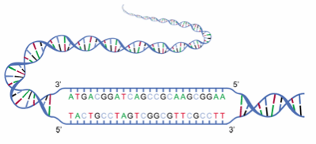
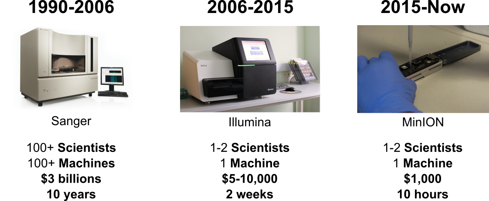
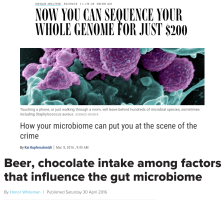
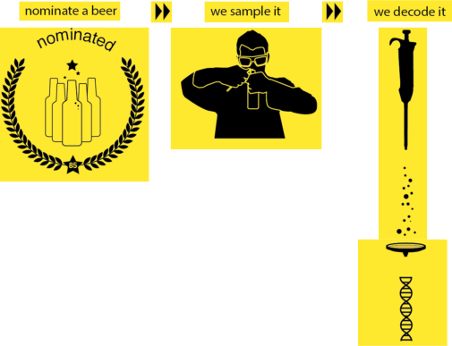

<!-- .slide: data-background="images/DSC_6894.jpg" data-state="dim-background" -->

## Beer is alive!

### How to use beer for scientific outreach

 

Teresa Müller & Bérénice Batut

<small>
Pint of Science - Freiburg - May 2019
</small>

---
<!-- .slide: data-background="images/anna.jpg" -->

----
<!-- .slide: data-background="images/craft_beer.png" data-state="dim-background" -->
### Anna loves craft beer

---

### What is a micro-organisms?

 <!-- .element width="85%" -->

<small>
[Sources](http://sitn.hms.harvard.edu/flash/2013/pandoraviruses-relics-of-a-hidden-domain-of-life/attachment/joe3/)
</small>

Note:

Need to change it probably

----

### Where can we find micro-organisms?

Note:

Make them vote for each image if there is micro-organisms

----

### Where can we find micro-organisms?

----

### Where can we find micro-organisms?

----

### Where can we find micro-organisms?

----

### Where can we find micro-organisms?

----

### Where can we find micro-organisms?

Note:

Make them vote for each image if there is micro-organisms

----

### And what about in humans?

The main view about micro-organisms in human

 <!-- .element width="100%" -->

<small>
Source: [NIAD](https://www.flickr.com/photos/niaid)
</small>

----

### And what about in humans?

But micro-organisms are mostly beneficial in humans

 <!-- .element width="60%" -->

----

### Do we have more micro-organism cells or  human cells in our own body?

- **10 times** more micro-organism cells than human cells
- More than **10,000** different microbe species in one human

----
### What about beer?

 <!-- .element width="100%" -->

---
### How to identify micro-organisms?

 <!-- .element width="100%" -->

Note:

- Historically, cultivation
- only 10% can be cultivated

----
<!-- .slide: data-background="images/unculturable.jpg" data-state="dim-background" -->

### More than 90% of micro-organisms are unculturable

----
### Any other solution?

- How can we compare micro-organisms?
- What do you have in common with any other living organisms?
- What does make you different from your neighbor?

---
### DNA the blueprint of life

 <!-- .element width="70%" -->

Note:

- DNA is the common element between organisms. 
- But how can you determine it's difference? 

----
### What is DNA?

 <!-- .element width="80%" -->

Note:

- alphabets
- ATCG small moleculs
- consits of atoms
- Atoms are social
- How can we now read the DNA?
 
----

### Do you remember?

 <!-- .element width="80%" -->

<small>
[Sources](http://sitn.hms.harvard.edu/flash/2013/pandoraviruses-relics-of-a-hidden-domain-of-life/attachment/joe3/)
</small>

---
### DNA Sequencing

 <!-- .element width="60%" -->

<small>
[Sources](https://lerninhalte.blogspot.com/2013/04/dna-sequenzierung-kettenabbruchmethode.html)
</small>

Note: 
- Sanger: Very accurate but not feasable whole genones!
Do you konw of any genome or sequencing projects?

----
### The Human genome project

 <!-- .element width="100%" -->

Note:
Huge development:
Next Generation Sequencing (NGS) or
High Throughput Sequencing (HTS)

----
### How much effort to sequence a human genome?

 <!-- .element width="100%" -->

---
### How to identify micro-organisms?

 <!-- .element width="100%" -->

----
### Which micro-organisms inside beers?

 <!-- .element width="75%"-->

----

### Sequencing and microbiota are part of our life

 <!-- .element width="60%"-->

---
<!-- .slide: data-background="images/freiburg.jpg" data-state="dim-background" -->

### Anna is not alone!

----

###  <!-- .element width="50%"-->

 <!-- .element width="100%"-->

[https://streetscience.community](https://streetscience.community)

----
<!-- .slide: data-background-color="#feed00" -->
### BeerDeCoded

Exploring the beer micro-organisms with everybody!

 <!-- .element width="70%" -->

<small>
[http://www.genome.beer/](http://www.genome.beer/)
</small>

Note: 

BeerDeCoded in Lausanne

----
<!-- .slide: data-background-color="#ffe92f" -->
### BeerDeCoded

 <!-- .element width="70%" -->

----
<!-- .slide: data-background="images/streetsciencecommunity_beerdecoded.png"-->

----
<!-- .slide: data-background="images/streetsciencecommunity_beerdecoded.png" data-state="dim-background" -->

### Interested? Wants to join?

Next workshops

- July with a school
- Before the end of 2019 for a general audience 

<i class="fas fa-globe"></i> [https://streetscience.community](https://streetscience.community)

---
<!-- .slide: data-background="images/beerdecoded.jpg" data-state="dim-background" -->

## Thank You!

 <!-- .element width="70%" -->

<i class="fas fa-globe"></i> [https://streetscience.community](https://streetscience.community)

<i class="fas fa-at"></i> [hello@streetscience.community](mailto:hello@streetscience.community)

<i class="fas fa-envelope"></i> [Mailing list](https://groups.google.com/forum/#!forum/streetsciencecommunity)
