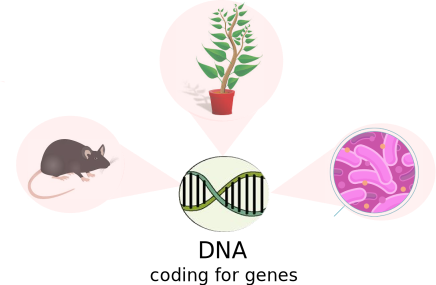
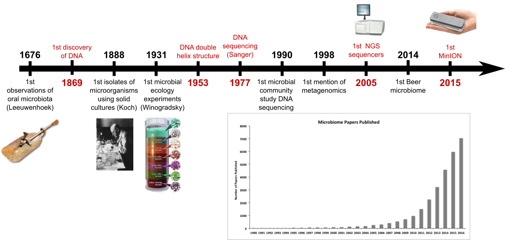

### Beer is alive!

Teresa Müller & Bérénice Batut

<small>
Pint of Science - Freiburg - May 2019
</small>

---

### What is a micro-organisms?

 <!-- .element width="90%" -->

Source: http://sitn.hms.harvard.edu/flash/2013/pandoraviruses-relics-of-a-hidden-domain-of-life/attachment/joe3/

Note:

Need to change it probably

----

### Where can we find micro-organisms?

Note:

Make them vote for each image if there is micro-organisms

----

### Where can we find micro-organisms?

----

### Where can we find micro-organisms?

----

### Where can we find micro-organisms?

----

### Where can we find micro-organisms?

----

### Where can we find micro-organisms?

Note:

Make them vote for each image if there is micro-organisms

----

### And what about in humans?

The main view about micro-organisms in human

 <!-- .element width="100%" -->

<small>
Source: [NIAD](https://www.flickr.com/photos/niaid)
</small>

----

### And what about in humans?

But micro-organisms are mostly beneficial in humans

 <!-- .element width="60%" -->

----

### And what about in humans?

Do you think we have more micro-organism cells or human cells in our own body?

- **10 times** more micro-organism cells than human cells
- More than **10,000** different microbe species in one human

----
### What about beer?

 <!-- .element width="100%" -->

---
### How to identify micro-organisms?

 <!-- .element width="100%" -->

Note:

- Historically, cultivation
- only 10% can be cultivated

----
### More than 90% of micro-organisms are unculturable

 <!-- .element width="80%" -->

----
### Any other solution?

- How can we compare micro-organisms?
- What do you have in common with any other living organisms?
- What does make you different from your neighbor?

---

 <!-- .element width="100%" -->
---

DNA
- explain what is DNA
- DNA and phylogenetic tree
- can be used to identify all organisms somewhere (beer)

---

 <!-- .element width="100%" -->

---

How can we know the DNA of something/someone?

Sequencing
- explain what is sequencing
- do they know some sequencing projects? companies?
- expand what you can investigate
- easy to do now and cheaper

---
### How to identify micro-organisms?

 <!-- .element width="100%" -->

----
### Which micro-organisms inside beers?

 <!-- .element width="75%"-->

---

### Sequencing and microbiota are part of our life

 <!-- .element width="80%"-->

----

### Make biology accessible to the public

science outreach

----

###  <!-- .element width="50%"-->

 <!-- .element width="100%"-->

[https://streetscience.community](https://streetscience.community)

---
<!-- .slide: data-background-color="#feed00" -->
### BeerDeCoded

Exploring the beer micro-organisms with everybody!

 <!-- .element width="70%" -->

Note: 

BeerDeCoded in Lausanne

----
<!-- .slide: data-background-color="#ffe92f" -->
### BeerDeCoded

----
### BeerDEcoded in Freiburg

Workshops for schools and citizens

[https://streetscience.community/projects/beerdecoded/](https://streetscience.community/projects/beerdecoded/)

---

## Thank you

Wants to join?

 <!-- .element width="70%" -->

<i class="fas fa-globe"></i> [https://streetscience.community](https://streetscience.community)

<i class="fas fa-at"></i> [hello@streetscience.community](mailto:hello@streetscience.community)

<i class="fas fa-envelope"></i> [Mailing list](https://groups.google.com/forum/#!forum/streetsciencecommunity)