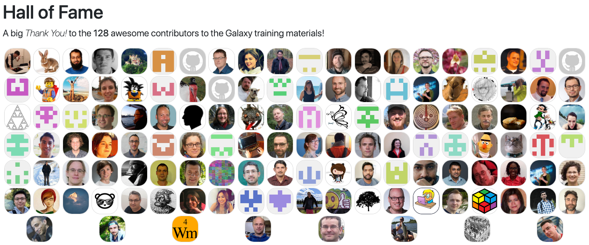
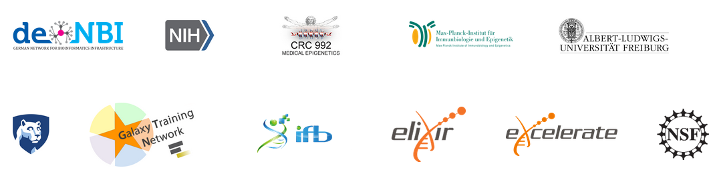

### Galaxy and Training
#### 2019 updates from the Galaxy Training Network

 <!-- .element width="60%" -->

Bérénice Batut and the Galaxy Training Network

<small>
Galaxy Community Conference - July 2019
</small>

---
<!-- .slide: data-background="images/student.jpg" -->

Note:

PhD student studying impact of microbiota and sex in microglya aging (she)

- Generates data: RNA-seq, metagenomics, metabolomics, etc
- No bioinformatician in her group
- Heard about Galaxy via one of its colleague
- It could help her
- but no idea how to use it to analyze its data

---
<!-- .slide: data-background="images/learner.jpg" data-state="dim-background" -->

## The learner's path

----
### Galaxy workshops

 <!-- .element width="85%" -->

<small>
https://galaxyproject.org/events/
</small>

Note:

- Heard about the Galaxy Training Network
- Attend one workshop organized by the GTN

----
### Tutorials from Galaxy Training Material

 <!-- .element width="85%" -->

https://training.galaxyproject.org/

Note:

2 days workshop on RNA-seq
- Learnt about Galaxy and RNA-seq data analysis
- Bookmarked the Galaxy Training Material website

---
<!-- .slide: data-background="images/back_to_lab.jpg" data-state="dim-background" -->

## Back to lab

Note:
- Back to lab, she applied the tutorials to her own data

----
### Back to data

 <!-- .element width="90%" -->

Note:
- Started to follow new ones in transcriptomics (number of new tutorials?)
- Following the learning paths

----
### Learning more?

- 19 topics
    - 5 new topics: Metabolomics, Computational Chemistry, Data manipulation, User Interface and Features, Ecological data analysis 

- 140+ tutorials
    - 68 new tutorials
        - 18 new tutorials for new topics
        - Migration of 23 admin tutorials
        - 27 new tutorials in existing topics

----
### Learning more?

 <!-- .element width="85%" -->

Note:
- How to find interesting ones?

    - Different levels
    - In Spanish (translation)
    - Search on TeSS (schemas annotation of each tutorial)

---
<!-- .slide: data-background="images/learner_to_teacher.jpg" data-state="dim-background" -->

## From learner to teacher

Note:

Becomes more and more confident with Galaxy use and data analysis: her colleagues always came to her with many questions

- Decides to organize a small Galaxy RNA-seq workshop at her institute: a bit afraid

----
### How to teach using Galaxy?

 <!-- .element width="85%" -->

Note:

- Found a topic on the training material to organize workshop
    - 5 tutorials and slides to kickoff tutorial
    - Philosophies

----
 <!-- .element width="75%" -->

<small>https://galaxyproject.eu/tiaas</small>

Note:

- Organization of a workshop: how to be sure the tutorials will work?  

----
### 60+ training - 1,200 participants

 <!-- .element width="90%" -->

<small>https://galaxyproject.eu/tiaas</small>

---
<!-- .slide: data-background="images/contributing.jpg" data-state="dim-background" -->

## Becoming a contributor

Note:

Got more requests to have workshops. But found also that some tutorials are missing (e.g. ATAC-seq data analysis)

- Decides to create new tutorials

----
### Online CoFest and community calls

 <!-- .element width="60%" -->

- Every 3 months
- One day of CoFest
- 2 community calls
- Next one: August, 15th 

Note:

- Attend one of the online CoFest

----
### A Training Development Kit

 <!-- .element width="100%" -->

Note:

- Check the contributing topic and found the Training Development Kit

----
### Feedbacks

 <!-- .element width="85%" -->

----
### Community of contributors

120+ contributors - 46 new ones

 <!-- .element width="90%" -->

<small>https://training.galaxyproject.org/hall-of-fame</small>

Note:

- Contribute and join the community of contributors

---

### 2019 updates

 <!-- .element width="100%" -->

Note:

- New content: 4 new topics, 66 new tutorials
- Features for users
    - Learning paths
    - Levels
    - Translation
    - Search box
- Resources about teaching and hosting Galaxy trainings
- TiaaS
- Workflow testing
- Online CoFest and community calls
- Training Development Kit with Planemo
- Feedbacks

---
## Thank you!

 <!-- .element width="80%" -->

[training.galaxyproject.org](https://training.galaxyproject.org)

 <!-- .element width="50%" -->

---

### 2019 updates

 <!-- .element width="100%" -->
