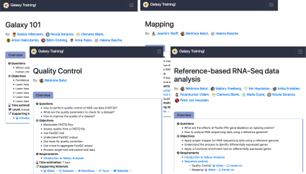
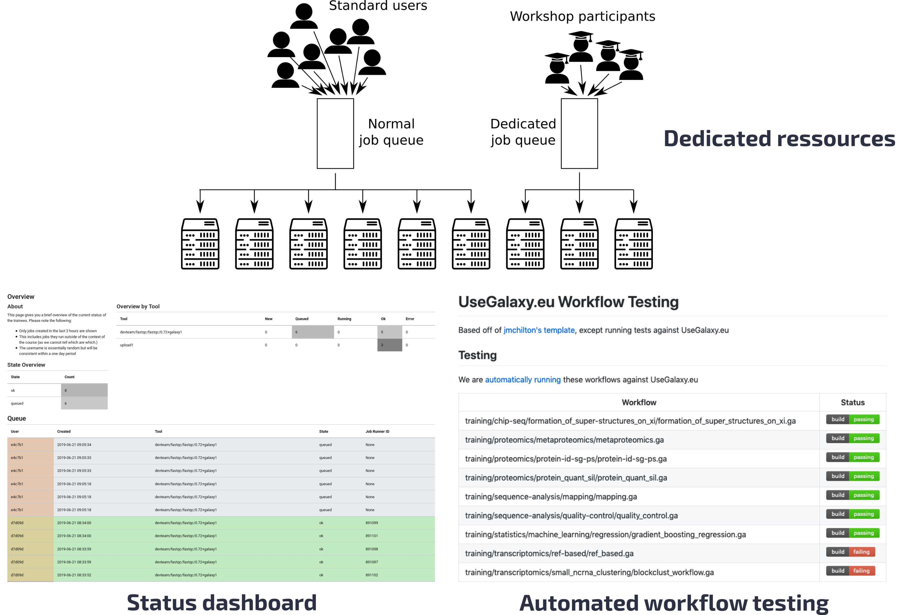

### Galaxy Training Network
#### Or how to reach communities?

 <!-- .element width="60%" -->

Bérénice Batut - [@bebatut](https://twitter.com/bebatut)

<small>
InterMine community call - December 2019
</small>

---
<!-- .slide: data-background="images/student.jpg" data-state="dim-background" -->

## How to reach the community of users?

Note:

PhD student studying impact of microbiota and sex in microglya aging (she)

- Generates data: RNA-seq, metagenomics, metabolomics, etc
- No bioinformatician in her group
- Heard about Galaxy via one of its colleague
- It could help her
- but no idea how to use it to analyze its data

----
### Galaxy workshops

 <!-- .element width="60%" -->

<small>
https://galaxyproject.org/events/
</small>

Note:

- Heard about the Galaxy Training Network
- Attend one workshop organized by the GTN

----
### Galaxy: a great solution for her!

 <!-- .element width="60%" -->

- Web interface for numerous bioinformatics tools
- No need to learn programming or HPC

----
### Tutorials from Galaxy Training Material

 <!-- .element width="85%" -->

<small>
https://training.galaxyproject.org/
</small>

Note:

2 days workshop on RNA-seq
- Learnt about Galaxy and RNA-seq data analysis
- Bookmarked the Galaxy Training Material website

----
### Back to lab and data

 <!-- .element width="50%" -->

20 topics / communities - 155+ tutorials

<small>
https://training.galaxyproject.org/
</small>

---
<!-- .slide: data-background="images/learner_to_teacher.jpg" data-state="dim-background" -->

## How to reach the community of instructors?

Note:

Becomes more and more confident with Galaxy use and data analysis: her colleagues always came to her with many questions

- Decides to organize a small Galaxy RNA-seq workshop at her institute: a bit afraid

----
### How to teach using Galaxy?

 <!-- .element width="85%" -->

Note:

- Found a topic on the training material to organize workshop
    - 5 tutorials and slides to kickoff tutorial
    - Philosophies

----
### A robust training infrastructure

 <!-- .element width="70%" -->

65+ trainings - 1,500 participants

<small>https://galaxyproject.eu/tiaas</small>

Note:

- Organization of a workshop: how to be sure the tutorials will work?  

---
<!-- .slide: data-background="images/contributing.jpg" data-state="dim-background" -->

## How to reach contributors from all communities?

Note:

Got more requests to have workshops. But found also that some tutorials are missing (e.g. ATAC-seq data analysis)

- Decides to create new tutorials

----
### A framework to facilitate contribution

 <!-- .element width="100%" -->

Note:

- Check the contributing topic and found the Training Development Kit

----
### Community events

 <!-- .element width="60%" -->

Online CoFest and community calls

- Every 3 months
- One day of CoFest
- 2 community calls

F2F hackathons

Note:

- Attend one of the online CoFest

----
### Community of contributors

 <!-- .element width="80%" -->

<small>https://training.galaxyproject.org/hall-of-fame</small>

Note:

- Contribute and join the community of contributors

---

### Training as community outreach

 <!-- .element width="90%" -->

---
## Thank you!

 <!-- .element width="60%" -->

<small>
<i class="fab fa-github"></i> [training.galaxyproject.org](https://training.galaxyproject.org)  
<i class="fab fa-github"></i> [github.com/galaxyproject/training-material](http://github.com/galaxyproject/training-material)  
<i class="fab fa-twitter"></i> [@gxytraining](https://twitter.com/gxytraining/)
</small>